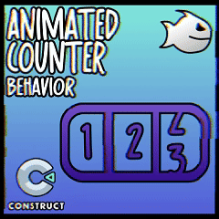

<br>
# Animated Counter
<i>A simple counter that animates from one number to another</i> <br>
### Version 1.0.0.0

[](https://github.com/armandoalonso/animated_counter/releases/download/piranha305_animatedcounter-1.0.0.0.c3addon/piranha305_animatedcounter-1.0.0.0.c3addon)
<br>
<sub> [See all releases](https://github.com/armandoalonso/animated_counter/releases) </sub> <br>

---
<b><u>Author:</u></b> piranha305 <br>
<b>[Addon Website](https://piranha305.itch.io)</b>  <br>
<sub>Made using [CAW](https://marketplace.visualstudio.com/items?itemName=skymen.caw) </sub><br>

## Table of Contents
- [Usage](#usage)
- [Examples Files](#examples-files)
- [Properties](#properties)
- [Actions](#actions)
- [Conditions](#conditions)
- [Expressions](#expressions)
---
## Usage
To build the addon, run the following commands:

```
npm i
npm run build
```

To run the dev server, run

```
npm i
npm run dev
```

## Examples Files
| Images | Description | Download |
| --- | --- | --- |
|  | animated_counter_excmaple | [](https://github.com/armandoalonso/animated_counter/raw/refs/heads/main/examples/animated_counter_excmaple.c3p) |

---
## Properties
| Property Name | Description | Type |
| --- | --- | --- |
| Initial Number | The initial number | float |
| Update Interval | Update interval in milliseconds, how often the counter will update | float |
| Step Size | how much to increment/decrement by each update tick | float |
| Use BBCode Template | If true, the BBCode template will be used to format the number | check |
| BBCode Template | The template for the BBCode, %v will be replaced with the counter value | text |


---
## Actions
| Action | Description | Params
| --- | --- | --- |
| Set BBCode Template | Set the BBCode template to format the number | Template             *(string)* <br> |
| Set Step Size | Set the step size of the counter, the amount to increment or decrement by each tick | Step Size             *(number)* <br> |
| Set Counter Update Interval | Set the update interval of the counter, how often the counter will update in milliseconds | Milliseconds             *(number)* <br> |
| Set Use BBCode Template | Set if the BBCode template should be used to format the number | Use             *(boolean)* <br> |
| Add | Add value to the counter | Value             *(number)* <br> |
| Set Target | Set the target value of the counter, this will start the animation | Target             *(number)* <br> |
| Set Value | Set the initial value of the counter, instantly | Value             *(number)* <br> |
| Set Value and Target | Set the initial value of the counter and the target value | Value             *(number)* <br>Target             *(number)* <br> |
| Subtract | Subtract value from the counter | Value             *(number)* <br> |
| Force Stop | Force stop the counter, set value to target |  |
| Stop | Stop the counter |  |


---
## Conditions
| Condition | Description | Params
| --- | --- | --- |
| Is Animating | Check if the counter is animating |  |
| Is Decreasing | Check if the counter is decreasing |  |
| Is Increasing | Check if the counter is increasing |  |
| On Animation End | Triggered when the counter stops animating |  |
| On Animation Start | Triggered when the counter starts animating |  |


---
## Expressions
| Expression | Description | Return Type | Params
| --- | --- | --- | --- |
| StepSize | Get the step size of the counter | number |  | 
| UpdateInterval | Get the counter update interval | number |  | 
| CurrentValue | Get the current value of the counter | number |  | 
| Diff | Get the difference between the current and target value | number |  | 
| TargetValue | Get the target value of the counter | number |  | 
